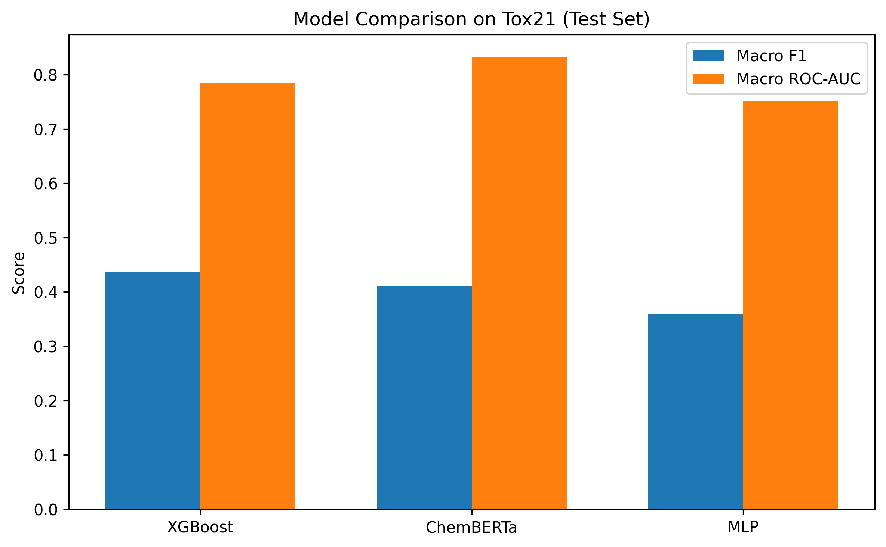

<strong>Project structure</strong>

toxicity-multiclass/
├── data/
│   ├── raw/                     # Raw Tox21 data (original files)
│   ├── processed/               # Cleaned / split datasets
│   └── features/                # Precomputed features (Morgan fingerprints)
│
├── notebooks/
│   ├── 01_exploring_cleaning data.ipynb
│   ├── 02_xgboost_baseline.ipynb
│   ├── 05_chemberta_training.ipynb
│   └── 06_evaluation_base_against_transformers.ipynb
│   
├── src/
│   └── toxicity/
│       ├── data/                # Downloading, cleaning, featurization code
│       ├── models/              # XGBoost, MLP, ChemBERTa implementations
│       └── training/            # Training loops 
│
├── results/                     # Metrics, scores, plots
├── models/                      # Saved trained models
├── scripts/                     # Small helper / launch scripts
│
├── app.py                       # Flask API for deployment
└── README.md

## Tox21 Multi-Label Toxicity Prediction

This project implements an end-to-end machine learning pipeline to predict molecular toxicity across 12 biological assays from SMILES representations.
Classical machine learning models (XGBoost, MLP) are compared with a domain-specific Transformer (ChemBERTa) to assess their effectiveness for computer-aided toxicology in a realistic, data-constrained setting.

## Project Motivation

Drug discovery suffers from high failure rates, often driven by late-stage toxicity. Experimental in vivo testing is costly, slow, and ethically sensitive, making early computational screening increasingly important.
This project focuses on:
•	Accelerating safety screening through in-silico toxicity prediction
•	Reducing experimental costs by filtering toxic compounds early
•	Comparing modern Transformer-based models with strong classical baselines on chemical data

## Dataset

The project uses the Tox21 (Toxicology in the 21st Century) dataset.
•	Approximately 7,000 molecules after cleaning
•	12 toxicity targets per compound (e.g. Nuclear Receptors such as NR-AR and Stress Response pathways such as SR-p53)
•	Multi-label setting with missing labels and strong class imbalance
These properties reflect real-world toxicology challenges and require careful modeling and evaluation choices.

## Models

 XGBoost (Morgan Fingerprints)
•	Molecules are represented using 2048-bit Morgan fingerprints
•	One classifier is trained per assay (binary relevance)
•	Provides strong and stable performance on tabular chemical features
 ChemBERTa (Transformer)
•	Pretrained on large-scale SMILES corpora
•	Fine-tuned for multi-label toxicity prediction
•	Uses masked loss so missing labels do not affect optimization
•	Particularly effective at ranking compounds by toxicity risk
 MLP (Multi-Layer Perceptron)
•	Neural baseline trained on the same fingerprint features as XGBoost
•	Serves as a reference point between tree-based models and Transformers

## Training Objective

Models are trained using binary cross-entropy loss in a multi-label setting.
For ChemBERTa, a label mask is applied so missing assay labels are ignored during loss computation, with optional positive class weighting to mitigate class imbalance.
This loss formulation is standard for multi-label toxicity prediction and aligns with the structure of the Tox21 dataset.

## Evaluation

  

Evaluation focuses on macro F1 score, with precision, recall, and ROC-AUC reported as complementary metrics.
•	Macro F1 reflects balanced decision quality across all assays and penalizes trivial all-negative predictions
•	ROC-AUC captures ranking performance independently of decision thresholds
A single global decision threshold is used, with a conservative value of 0.7 applied for deployment.
All reported statistics and comparisons are computed in Notebook 06 (06_evaluation_base_against_transformers.ipynb).

## Performance Summary 

| Model       | Macro F1 (Test) | Macro ROC-AUC (Test) |
|-------------|-----------------|----------------------|
| XGBoost     | 0.4371          | 0.7852               |
| ChemBERTa   | 0.4109          | 0.8320               |
| MLP         | 0.3596          | 0.7505               |

XGBoost achieves the highest decision-level performance (macro F1), while ChemBERTa provides superior ranking ability (ROC-AUC). These results highlight the trade-off between ranking and classification performance in imbalanced multi-label settings.

## Installation and Usage

pip install rdkit xgboost transformers torch pandas numpy scikit-learn matplotlib

## Pipeline Execution

1. **Data cleaning**
Run 01_exploring_cleaning data.ipynb(or prepare_data.py) to process and standardize raw SMILES.

2. **Featurization**
Execute make_fingerprints.py to generate 2048-bit Morgan fingerprints.

3. **Model training**
    o	XGBoost: 02_xgboost_baseline.ipynb
    o	MLP: 03_mlp_baseline.ipynb
    o	ChemBERTa: 05_chemberta_training.ipynb

4. **Evaluation and comparison**
Analyze and reproduce all reported metrics using
06_evaluation_base_against_transformers.ipynb.

